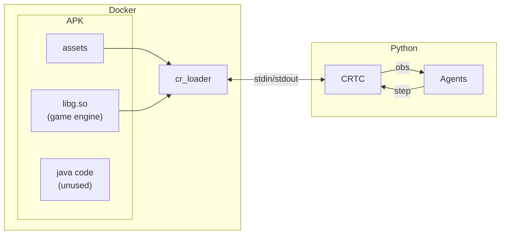

# CRTC: The Training Camp

[](https://colab.research.google.com/github/b10902118/crtc/blob/main/examples/colab.ipynb) [](https://discord.gg/sBVhxShV2y)

A reinforcement learning environment for the old good CR.

<details><summary>
How it works
</summary>
This project runs CR on your PC using a custom loader to interact directly with the C++ game engine. A Python wrapper communicates with the loader to expose a standard RL environment API.



</details>

## Getting Started

### [Google Colab](https://colab.research.google.com/github/b10902118/crtc/blob/main/examples/colab.ipynb)

Everything included. Click `Run all` to try it out.

### Local Setup

Requirements:

- **Linux** (WSL or MacOS should also work, not tested)
- **Docker** (recommended)
- **QEMU** (for docker if host cannot run 32-bit natively)

---

1. Get the source

   ```bash
   git clone https://github.com/b10902118/crtc.git
   cd crtc
   ```

2. Install it and compile the loader using Docker

   x86:

   ```bash
   docker compose run --rm -it install-x86 --graphics
   ```

   arm:

   ```
   docker compose run --rm -it install-arm --graphics
   ```

   - The scripted APK download can be slow. You can manually download CR 1.9.2 from faster sources like APKMirror and save it as `1.9.2.apk`
   - For other installation configs. see [Installation Details](#installation-details)

3. Install the python environment

   ```bash
   pip install .
   ```

   `-e` is recommended for debugging.

4. Run the environment with display

   ```python
   from crtc import CRTC
   from crtc.utils import print_observation
   import time

   env = CRTC(render_mode="human")
   observations, infos = env.reset() # use the default deck
   print_observation(observations)

   # play the first card at each player's down-left corner
   env.step(((0, 0, 31), (0, 0, 31)))

   term = False
   while not term:
     observations, _, terms, _, infos = env.step(((-1, 0, 0), (-1, 0, 0)))
     term = terms[0]
     print_observation(observations)
     time.sleep(1 / 60) # some delay for watching
   ```

   You can also play it interactively

   ```bash
   python -m crtc.interactive
   ```

## API

The environment follows [PettingZoo's Parallel API](https://pettingzoo.farama.org/api/parallel/), which is a multi-agent version of Gymnasium.

See [doc/api.md](./doc/api.md).

## Installation Details

There are several ways to compile the C++ loader. Docker is the cleanest solution, and there is a way to run docker-compiled executables on host directly if your OS and CPU support 32-bit execution. Of course you can also set up the development environment on host OS.

| runtime\compile | docker                                                     | host                   |
| --------------- | ---------------------------------------------------------- | ---------------------- |
| docker          | `docker compose run install-{x86\|arm}`                    | X                      |
| host            | `docker compose run install-{x86\|arm} --portable-runtime` | `./scripts/install.sh` |

- The build is in `./env/build_loader/`, to be launched by the python package via `./env/build_loader/run.sh`.
- For rendering, add `--graphics`, which adds graphical libraries as dependencies.
- For compile and run at host, basically you have to install the packages in [Dockerfile](./Dockerfile) **in your machine's 32-bit architecture** and run `./scripts/install.sh`

## TODO

### Short Term

- Add tests
- Fix bugs
- Record replay

C++:

- Provide more complete states, for example
  - witch/buildings summon CD
  - prince charge CD & state
  - next card CD
  - previous card (for mirror)
  - projectile heading direction
- Remove unneeded UI

Python:

- Improve logging
- Improve card/object data API
  - get precise value by level
  - remove unneeded entries

### Long Term

C++:

- Split out loader and unlock more comprehensive APIs

Python:

- Match bots remotely

## Acknowledgement

Special thanks to the incredible previous works on server and assets that laid the foundation for this project.

## License: GNU GPLv3

**We believe in keeping open-source open**. This project builds upon the incredible effort of previous open-source works licensed under the GPL. In that same spirit of shared community progress, all derivative works must remain open-source. Let's build together!
