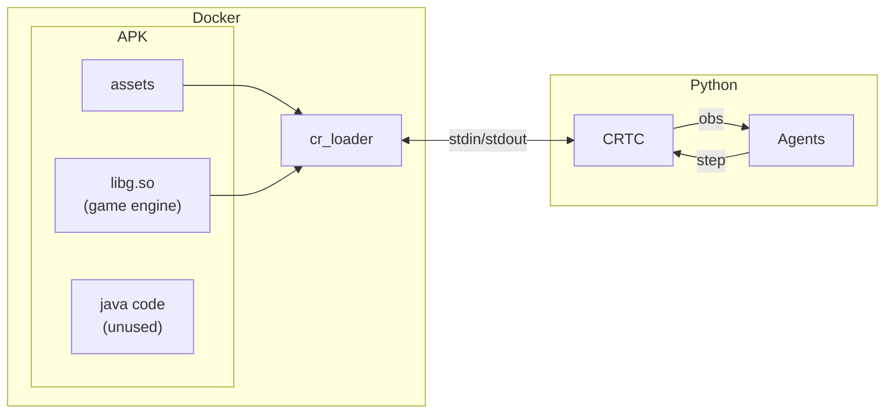

# CRTC: The Training Camp

[](https://colab.research.google.com/github/b10902118/crtc/blob/main/examples/colab.ipynb)

A reinforcement learning environment for the old good CR.

<details><summary>
How it works
</summary>
This project runs CR on your PC using a custom loader to interact directly with the C++ game engine. A Python wrapper communicates with the loader to expose a standard RL environment API.



</details>

## Getting Started

### [Google Colab](https://colab.research.google.com/github/b10902118/crtc/blob/main/examples/colab.ipynb)

Everything included. Click `Run all` to try it out.

### Local Setup

Requirements:

- **Linux** (WSL or MacOS should also work, not tested)
- **Docker** (recommended)
- **QEMU** (for docker if host cannot run 32-bit natively)

---

1. **Get the APK** (APKMirror is your friend). Put it in the project root as `1.9.2.apk`.
   - can also let the script download it (slow!)

2. Install it and compile the loader using Docker

   x86:

   ```bash
   docker compose run --rm install-x86 --graphics
   ```

   arm:

   ```
   docker compose run --rm install-arm --graphics
   ```

   For other methods. see [Installation Details](#installation-details)

3. Install the python environment

   ```bash
   pip install -e .
   ```

   `-e` is recommended for debugging.

4. Run the environment with display

   ```python
   from crtc import CRTC
   from crtc.utils import print_observation
   import time

   env = CRTC(render_mode="human")
   observations, infos = env.reset() # use the default deck
   print_observation(observations)

   # play the first card at each player's down-left corner
   env.step(((0, 0, 31), (0, 0, 31)))

   term = False
   while not term:
     observations, _, terms, _, infos = env.step(((-1, 0, 0), (-1, 0, 0)))
     term = terms[0]
     print_observation(observations)
     time.sleep(1 / 60) # some delay for watching
   ```

   You can also play it interactively

   ```bash
   python -m crtc.interactive
   ```

## API

The environment follows [PettingZoo's Parallel API](https://pettingzoo.farama.org/api/parallel/), which is a multi-agent version of Gymnasium.

### `CRTC` Class

The main environment class, inheriting from `pettingzoo.ParallelEnv`.

#### `__init__(self, cmd=None, summon_delay=20, display_dim=(450, 800), trainer_view=False, render_mode=None, fps=15)`

Initializes the environment.

- `cmd` (list[str]): Command arguments to launch the loader. Default `None` to use `./build_loader/run.sh`
- `summon_delay` (int): The delay between playing a card and really summoning it, in ticks (default: 20, which is 1s, not sure the game's real value)
- `display_dim` (tuple): Width and height of the rendered image (default: `(450, 800)`).
- `trainer_view` (bool): If `True`, the rendered bottom player will be trainer. No effect to coordinates.
- `render_mode` (str): `"human"`, `"rgb_array"`, or `None` (headless).
- `fps` (int): If > 0, then max fps for rendering in `"human"` mode. (default: -1).

#### `reset(self, seed=None, options=None) -> (observations, infos)`

Resets the game session.

- `seed` (int): Seed for randomness (e.g., deck shuffling).
- `options` (dict): Optional settings:
  - `decks` (dict): Dict mapping agent IDs (`0` for `TRAINER`, `1` for `PLAYER`) to custom decks (list of 8 card dicts with `name` and optional `level`).
  - `shuffle` (bool): Whether to shuffle the player/trainer decks before starting.

#### `step(self, actions) -> (observations, rewards, terminations, truncations, infos)`

Advances the game state by one tick.

- `actions` (dict): Dict mapping agent IDs to actions:
  - An action is `(hand_idx, grid_x, grid_y)`. `hand_idx = -1` is nop.
  - `grid_x`, `grid_y` is the `int` coordinates with origin (0, 0) at **the top-left cell viewed from each player's side** (TRAINER's origin is mirrored to PLAYER's bottom-right)

#### `render(self) -> np.ndarray | None`

Renders the environment screen. If `render_mode` is `"human"`, updates the display window. If `"rgb_array"`, returns a numpy array representing the image.

#### `close(self)`

Terminates the simulator subprocess and cleans up Tkinter window components.

#### `get_card_data(self, card_name) -> dict | None`

Retrieves the card's attributes read from CSV.

#### `get_object_data(self, obj_name) -> dict | None`

Retrieves the game object's attributes read from CSV.

### Observation Space (Work in Progress)

Each agent's observation contains:

- `tick` (int): 1 tick is 0.05s

- `elixir` (tuple[int, int]): the first is the whole number and the second represents the fraction with `elixir_denominator` as denominator

- `elixir_denominator` (int): 280000 in single elixir and 140000 in double elixir

- `deck` (tuple[{"name": str, "level": int}, ...], length=8)

- `hand` (tuple[int, int, int, int]): the indices of the hand cards in the deck

- `next_card` (int): the index of the next card in the deck

- `crown` (int): the number of enemy towers destoryed

- `game_objects`: (list[dict]): each game object is either `Character`, `Building`, `Projectile`, or `Area Effect`
  - **Characters & Buildings**
    - `name` (str)
    - `owner` (int): The owner's account index (`TRAINER(0)`, `PLAYER(1)`)
    - `x` (int): 1000 for 1 grid
    - `y` (int): 1000 for 1 grid
    - `h` (int)
    - `heading_x` (float): (`heading_x`, `heading_y`) normalized to 1
    - `heading_y` (float): (`heading_x`, `heading_y`) normalized to 1
    - `hp` (int)
    - `shield` (int)
    - `state` (int): `IDLE(0)`, `MOVING(1)`,`ATTACKING(2)`, `DEPLOYING(5)`. The other values are unknown
    - `attack_duration` (int): The time length of its most recent consecutive attack in ms. Use this to compute attack cooldown
    - `deploy_time` (int): The remaining deploy time in ms
    - `buffs` (list[str]): The names of the buffs the character has
  - **Projectiles & Area Effects**
    - `name` (str)
    - `owner` (int): The owner's account index (`TRAINER(0)`, `PLAYER(1)`)
    - `x` (int): 1000 for 1 grid
    - `y` (int): 1000 for 1 grid
    - `h` (int)

## Installation Details

There are several ways to compile the C++ loader. Docker is the cleanest solution, and there is a way to run docker-compiled executables on host directly if your OS and CPU support 32-bit execution. Of course you can also set up the development environment on host OS.

| runtime\compile | docker                                                     | host                   |
| --------------- | ---------------------------------------------------------- | ---------------------- |
| docker          | `docker compose run install-{x86\|arm}`                    | X                      |
| host            | `docker compose run install-{x86\|arm} --portable-runtime` | `./scripts/install.sh` |

- The build is in `./env/build_loader/`, to be launched by the python package via `./env/build_loader/run.sh`.
- For rendering, add `--graphics`, which adds graphical libraries as dependencies.
- For compile and run at host, basically you have to install the packages in [Dockerfile](./Dockerfile) **in your machine's 32-bit architecture** and run `./scripts/install.sh`

## TODO

### Short Term

- Add tests
- Fix bugs
- Record replay

C++:

- Provide more complete states, for example
  - witch/buildings summon CD
  - prince charge CD & state
  - next card CD
  - previous card (for mirror)
  - projectile heading direction
- Remove unneeded UI

Python:

- Improve logging
- Improve card/object data API
  - get precise value by level
  - remove unneeded entries

### Long Term

C++:

- Split out loader and unlock more comprehensive APIs

Python:

- Match bots remotely

## [Discord Server](https://discord.gg/sBVhxShV2y)

## Acknowledgement

Special thanks to the incredible previous works on server and assets that laid the foundation for this project.

## License: GNU GPLv3

**We believe in keeping open-source open**. This project builds upon the incredible effort of previous open-source works licensed under the GPL. In that same spirit of shared community progress, all derivative works must remain open-source. Let's build together!
